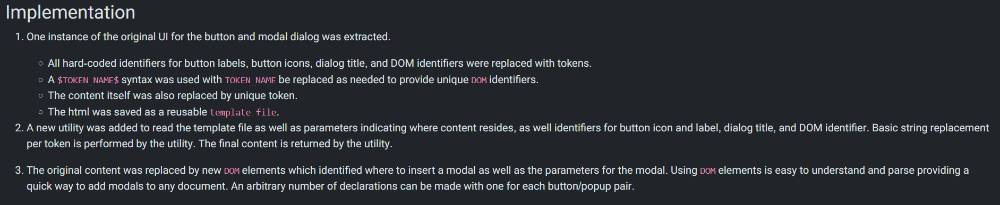

<!--Start-->

# What are Components

Components are ui elements that are reusable across design projects
Any time a change is made to the main component the instances are automatically updated. This allows for 
faster workflows, more consistent design system and makes it easier to collaborate with other designers for large scale projects.

The master component is created when you first turn a UI element into a component and defines the properties of the component.

The instance is a copy of the master component you can reuse across designs. Instances are linked to master components. When you make changes to a master component it applies the changes to the instance.  An exception to this is instance overrides. 

When using Figma you can identify which elements are master components and which are instances by the icon in the layers panel. Master components use a 4 diamond icon while instances use a single diamond icon.

## Organizing and Structuring Components

When naming layers it is best to use forward slash naming to create hierarchy.
 
Example Layer Structure:
  - Input/Field/Text - Active
  - Input/Field/Text - Default
  - Input/Field/Text - Disabled
  - Input/Field/Text - Feedback
  - Input/Field/Text - Filled
  - Input/Field/Text - View Only

For access to a wider subcategory of “related components” in the instance menu you can combine the last two labels, ie. the input type (text) and input status (default), by separating them with a dash instead of a slash. This is particularly useful for larger categories with many subcategories. Components can be grouped in frames to better visualize its purpose such as for a data table, dropdowns etc.
 
Another guideline to follow is to choose an easy to understand method for structing component states and variations. You can do this by separating master components for each variation. This makes it fast and consistent to change the state of instance, change multiple instances at the same time, or  save text overrides when updating a state or variation.
  
Using nested atomic components as global building blocks is another reccomended approach. Do this by creating a set of reusable atomic components with the sole purpose of nesting atomic instances inside other related components. Take textfields as an example. We can turn a textfield’s shape into an atomic component and nest it’s instances inside every other textfield component we create. This means all textfields use the exact same building block (i.e., the atomic instance) and if the shape of textfields were to change, all we’d need to do is update the atomic component and all other textfield components would update too.

Using an atomic approach allows you to seamlessly apply globalized changes to components which makes it much easier to maintain your system.

## Best Practises When Working with Components

Shown below are various tips when designing components.

1. When working with components, set up constraints and a layout grid to show the responsive behavior of the component(s) as it is resized.

2. Preserve text overrides on instance swaps. To do this make sure the text layer within each component share the same name (e.g., “Button Text”). If you don’t do this your text overrides will not persist and you’ll need to manually update the text after you swap instances.
	 
3. Use clip content to reduce repetitive instances. Toggle whether or not elements extend beyond the bounds of the component are cropped or hidden
	 
4. Document components when hovering over it in the assets panel: provides context as to how it works and fits with the product 

5. Use instance overrides to adapt components. This allows you to override properties of instance without breaking link to master component. It can be used on text, color, effects (drop shadow, blur), advanced (size of component, swap nested instance, toggle on/off layers). Any updates to master component do not revert overrides in first gif sequence above. You can always reset overrirdes to go back to original properties

6. Swap components by simply right clicking on the instance you want to switch and go to the Swap instance item. A submenu will appear with a list of related components. 

7. Detach an instance when you want to make a new component, or unique element. 

# Accessibility (WCAG)

The **Web Content Accessibility Guidelines (WCAG)**, created by the World Wide Web Consortium (W3C), provide a comprehensive framework for designing digital experiences that are accessible to users with disabilities. 
These guidelines ensure that digital products are inclusive and intuitive to use for all users.

### **Core Principles of Accessibility (POUR)**  
To create an accessible experience, WCAG is structured around four principles:  

- **Perceivable**: Content and interface elements must be perceivable through one or more senses. For example, users relying on screen readers or visual cues should be able to interpret the information.  
- **Operable**: Navigation and interactive elements must work for all users, including those who use alternative methods such as touch or voice controls.  
- **Understandable**: Content and functionality must be intuitive and easy to comprehend.  
- **Robust**: Digital interfaces accommodate a wide range of assistive tools and are able to be adapted for technological advances and changing user bases.  

### **WCAG Conformance Levels: A, AA, and AAA**  
WCAG defines three levels of conformance to the accessibility guidelines.  

#### **Level A (Basic Accessibility)**  
This level addresses essential accessibility features that every website should meet to ensure basic usability. Requirements include:  
- Full access to content using a keyboard.  
- Clearly labeled forms with clear instructions.  
- Compatibility with assistive technologies.  
- Avoiding reliance on visual cues like shape, size, or color alone to convey critical information.  

#### **Level AA (Enhanced Accessibility)**  
This level has additional requirements such as:  
- Adequate contrast between text and background (minimum 4.5:1).  
- Logical, structured headings (e.g., H1, H2, H3) to improve content organization.  
- Consistent navigational elements across all pages.  

#### **Level AAA (Optimal Accessibility)**  
This level is designed to offer the highest degree of accessibility but may not be practical for all content. Requirements include:  
- Higher contrast ratios (minimum 7:1) for text and backgrounds.  
- Sign language interpretation for pre-recorded video.  
- Detailed audio descriptions for video content.  

By aligning digital designs with WCAG guidelines, UX designers can create inclusive experiences that prioritize user needs and remove barriers for individuals with disabilities.

# Accessibility Checks 

### Color Contrast and Font Check
When developing components it is important to check that colors used for content such as text and the background meet the minimum accessiblity requirements.

This example uses the MaterialX Lab resource website. The contrast ratio between the text and the background is checked to see if the content is AA compliant.

 

The resource used for testing is the accessible-colors.com website which allows users to enter font size, weight and background color to check for AA/AAA compliance.

The website passes the AA/AAA check. If the website did not pass the site will suggest the nearest accessible combination by modifying the color lightness of the font or the background.

 

An example of text/background colors that need to be altered is the color code #0000FF (blue) on a dark background with the color code of #212529. To be AA compliant the backround must be lightened or the text color lightened to be AA compliant. 

 

<!--End-->